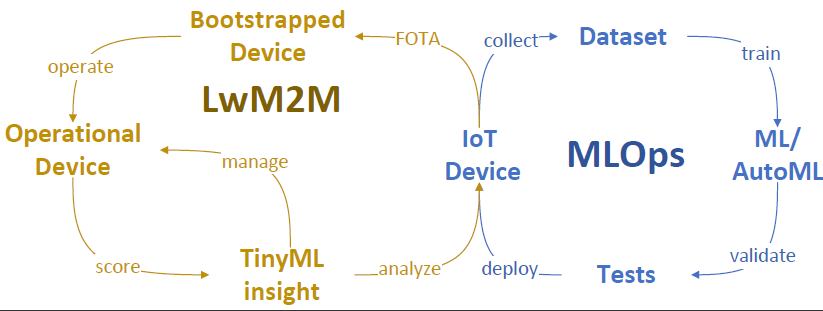
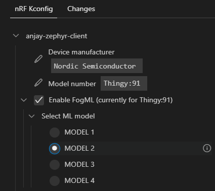

# FogML-Zephyr-FOTA
The application is the result of research conducted jointly with the [AVSystem](https://www.avsystem.com/). It demonstrated how the LwM2M protocol may support TinyMLOps on resource-constrained devices. The source code supplements the research paper submitted to the TinyML symposium. More details will be provided at a convenient time.

Code of the application is based on https://github.com/AVSystem/Anjay-zephyr-client/tree/master/demo.

# TinyML lifecycle Management



The figure shows how the LwM2M protocol enhances the Tiny ML model development process for resource-constrained devices. The proposed enhancement consists of 4 states:
 - IoT device - A TinyML model is developed and runs on the IoT device. Testing and verification of operations take place mainly in a controlled environment. The device software containing the new version of the ML model can be remotely uploaded to the device via the firmware update mechanism.
 - Bootstrapped device - LwM2M device connects to LwM2M Bootstrap Server during the first or every bootup procedure to initialize the data model and to obtain addresses of LwM2M servers that the device should connect to. LwM2M protocol provides mechanisms for secure end-to-end communication.
 - Operational device - LwM2M protocol provides device state update to the LwM2M server. Communication mechanisms include several solutions to reduce resource consumption and monthly dataplan. In addition, the results of TinyML operation on the device are constantly updated on the server and can be accessed via a dedicated API by third-party applications.
 - TinyML insight - dedicated LwM2M objects allow to assess of the TinyML model's operating status on the device and, if necessary, to correct operating parameters or for further analysis and development of a new version of the model.


To sum up, the following LwM2M Objects are supported by the application to support MLOps:
 - Firmware Update (/5) - used to perform FOTA, e.g. with new ML model version.
 - ML Model object (/33654) - used to describe the ML model used on the device.
 - Pattern Detector (/33650) - represents the results of the pattern classifier applied to the sensor data.
 - Anomaly Detector (/33651) - used to report the situations for which the anomaly detection module detected abnormal behaviour.
 - Anomaly Analyzer object (/33653) - mainly used for diagnostic purposes and can be used for TinyML model insight. It aims to indicate specific situations in the device's operation that were not considered during the ML model training process. 

In the `LwM2M_objects_def` folder, XML object definitions are presented. They can be added to the AVSystem Coiote LwM2M server to visually display the object values in the GUI.

# Supported hardware

The application is designed for Thingy:91 device:
 - [thingy91_nrf9160_ns](https://developer.nordicsemi.com/nRF_Connect_SDK/doc/latest/nrf/ug_thingy91.html)

Thingy:91 integrates an nRF9160 SiP that supports LTE-M and NB-IoT connectivity.

# Building the project

The project can be built as in the Anjay client description. Alternatively, the default SDK installed with the nRF Connect utility can be modified to use Anjay LwM2M client. To do this, edit the file `[default_sdk_folder]/ncs/v2.0.0/nrf/west.yml` by adding:
```
  - name: Anjay-zephyr
    submodules: true
    remote: anjay
    revision: 3.1.2
    path: modules/lib/anjay
```
and
```
  - name: anjay
    url-base: https://github.com/AVSystem    
```

Then, according to
https://nrfconnect.github.io/vscode-nrf-connect/connect/west.html :

```
To update a west workspace:

    Open the Command Palette and type nRF Connect: West Update
    Choose the location of your project repository and west begins to update.
```

# Choosing the FogML MODEL
In the application, we use FogML tools to recognize device movement patterns. To simplify the process of ML model integration and selection, each ML model is stored in the seperatefolder i.e. MODEL1, MODEL2, etc. Then using `Kconfig` proper one can be selected and compiled with the firmware.



There are two models in the source code:
- MODEL1 - recognizes circle, snake, and idle movements
- MODEL2 - recognizes circle, snake, up-down and idle movements

In addition, there are pre-compiled images in the binary_images directory for quick testing of applications for Thingy:91. These images can be sent to the device using FOTA.

In order to fit the ML models in Thingy:91 memory, GPS has to be switched off in Kconfig.

# Controlling FogML on the device using Zephyr Shell

FogML processing pipeline can be controlled via Zephyr Shell:
 - `fogml start` - Start FogML processing
 - `fogml stop` - Stop FogML processing
 - `fogml state` - Show FogML state
 - `fogml verbose` - FogML verbose mode

# ML model and firmware upgrade using FOTA

LwM2M supports FOTA process through Firmware Update (/5) object. Follow the instructions provided in the Anjay Zephyr Client and Coiote Server.

# Connecting to the LwM2M Server

To connect to [Coiote IoT Device
Management](https://www.avsystem.com/products/coiote-iot-device-management-platform/)
LwM2M Server, please register at https://eu.iot.avsystem.cloud/, and then follow the instructions in Anjay-Zephyr-Client.

Click "Add your fitst device"
"via the Management Server"
"Put enpoint name" and "Key"

click "Add device" and configure Thingy:91 using Zephyr Shell:

```
uart:~$ anjay config set uri coaps://eu.iot.avsystem.cloud:5684
uart:~$ anjay config set endpoint ...
uart:~$ anjay config set psk ...
uart:~$ anjay config save
uart:~$ anjay start
```

NOTE: You may use any LwM2M Server compliant with LwM2M 1.0 TS, however the aforementioned LwM2M objects definition can be added in the Coiote Server. 


# Summary
To summarise, TinyML solutions are a milestone in developing Internet of Things systems. However, it is necessary to ensure service enablement mechanisms, over-the-air firmware updates, and secure connectivity to cloud computing services to take full advantage of this class of solutions. Furthermore, using low memory footprint ML libraries such as FogML leads to flexibility in designing more complex and connected embedded applications. Finally, requirements related to device management and data reporting can be satisfied by the LwM2M protocol, which solves many technological challenges encountered when implementing IoT solutions on a large scale, especially when connected using LPWAN technologies.